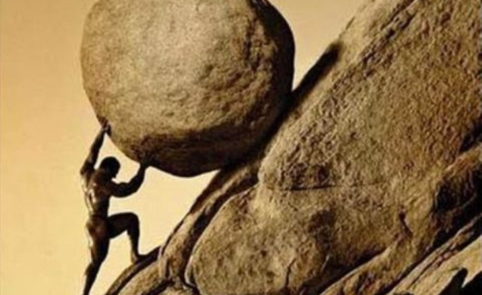

In the series Yellowstone, there is a character named Jamie Dutton who accidentally commits murder.

Because he belongs to a powerful family with deep connections, he escapes legal consequences.

But the psychological consequences remain.

The guilt begins to consume him internally.

His father tells him to leave his job and come live on the ranch as a cowboy, to work with the horses and immerse himself in the daily rhythm of ranch life.

So he does.

Jamie later asks his brother, Kayce Dutton, how he managed to live with the things he experienced as a former U.S. Army soldier, the violence, the killing, the memories of both criminals and innocents.

Kayce replies:

“Just lose yourself in the work. That’s all we do.”

That line captures something ancient about human nature.

Work does not magically erase guilt, grief, or pain.
But meaningful work reduces idle space.

Idleness gives unresolved thoughts unlimited room to grow.

This same idea appears in the Greek myth of Sisyphus, the man cursed to push a boulder up a hill for eternity, only for it to roll back down again.

At first glance, the punishment seems meaningless.
Yet philosopher Albert Camus argued that Sisyphus becomes free the moment he accepts the struggle itself.

The boulder never disappears.

The meaning comes from carrying it anyway.

Human beings often suffer more from aimlessness than from hardship with purpose.

A ranch hand waking before sunrise to feed horses may be psychologically healthier than someone with unlimited free time and no direction at all.

Because structure matters.

Responsibility matters.

Movement matters.

Service matters.

Purpose gives pain somewhere to go.

But there is also a danger in this idea.

Healthy work can help integrate pain.
Endless busyness can also become avoidance.

If someone spends their entire life burying themselves in work without ever confronting what lies underneath, the mind eventually catches up. That is why some people remain constantly busy yet still feel hollow the moment everything becomes quiet.

The balance is usually found in:

• meaningful responsibility
• physical movement
• structure
• service to others
• and periods of honest reflection

This theme appears again and again in stories, philosophy, religion, and psychology because it reflects something deeply human:

People generally endure suffering better when they suffer toward something.